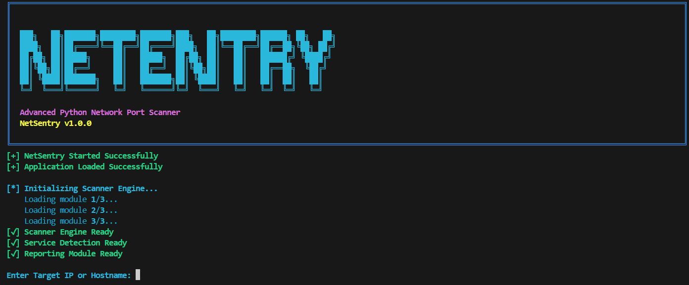

<div align="center">

# 🛡️ NetSentry

### Advanced Python Network Port Scanner for Cyber Security Professionals


Fast • Lightweight • Multithreaded • Professional Reporting

</div>

---

# 📖 Table of Contents

- Overview
- Features
- Project Structure
- Technologies Used
- Installation
- Usage
- Example Output
- Reports
- Future Enhancements
- License
- Author

---

# 🚀 Overview

NetSentry is a professional Python-based network port scanner developed for Cyber Security students, penetration testers, and security analysts.

It performs high-speed multithreaded TCP port scanning, detects running services, grabs service banners, verifies host availability, and generates detailed reports in multiple formats.

The project follows a modular architecture for scalability, maintainability, and future feature expansion.

---

# ✨ Features

| Feature | Status |
|----------|--------|
| TCP Port Scanner | ✅ |
| Multithreading | ✅ |
| Host Discovery | ✅ |
| Service Detection | ✅ |
| Banner Grabbing | ✅ |
| Progress Bar | ✅ |
| Colored CLI Output | ✅ |
| Logging | ✅ |
| Scan History | ✅ |
| JSON Report | ✅ |
| CSV Report | ✅ |
| HTML Report | ✅ |
| PDF Report | ✅ |
| Input Validation | ✅ |
| Cross Platform | ✅ |

---

# 📂 Project Structure

```text
NetSentry/
│
├── main.py
├── requirements.txt
├── README.md
├── LICENSE
│
├── scanner/
│   ├── scanner.py
│   ├── banner.py
│   ├── service.py
│   ├── report.py
│   ├── pdf_report.py
│   ├── history.py
│   ├── host.py
│   ├── logger.py
│   ├── validator.py
│   ├── config.py
│   └── exceptions.py
│
├── reports/
├── history/
├── logs/
└── tests/
```

---

# 🛠 Technologies Used

- Python 3.12
- Socket Programming
- ThreadPoolExecutor
- tqdm
- colorama
- reportlab
- JSON
- HTML
- CSV

---

# ⚙ Installation

Clone Repository

```bash
git clone https://github.com/megh3905/NetSentry.git
```

Go into project directory

```bash
cd NetSentry
```

Install dependencies

```bash
pip install -r requirements.txt
```

---

# ▶ Usage

Scan default ports

```bash
python main.py scanme.nmap.org
```

Scan custom range

```bash
python main.py scanme.nmap.org --start 1 --end 1000
```

Scan localhost

```bash
python main.py 127.0.0.1
```

---
```markdown
# 📊 Example Output



```text
Target : scanme.nmap.org

Host Status : Alive

Scanning Ports...

Scanning: 100% |████████████████████████|

Open Ports

22    SSH
80    HTTP
443   HTTPS

Reports Generated Successfully

Scan Completed
```

---

# 📁 Reports

After every successful scan NetSentry automatically generates:

- JSON Report
- CSV Report
- HTML Report
- PDF Report

All reports are stored inside

```
reports/
```

---

# 🏗 Architecture

```
User
   │
   ▼
Input Validation
   │
   ▼
Host Discovery
   │
   ▼
TCP Scanner
   │
   ▼
Service Detection
   │
   ▼
Banner Grabbing
   │
   ▼
Report Generator
   │
   ▼
History & Logs
```

---

# 🔮 Future Enhancements

- UDP Port Scanning
- OS Fingerprinting
- CVE Lookup
- NSE Script Support
- GUI Interface
- Export to XML
- Scheduled Scans
- Docker Support

---

# 🤝 Contributing

Contributions, improvements, and suggestions are welcome.

Fork the repository

Create a new branch

Commit your changes

Open a Pull Request

---

# 📜 License

This project is licensed under the MIT License.

---

# 👨‍💻 Author

### Megh Bhavsar

Bachelor of Engineering in Computer Science & Engineering (Cyber Security)

---

<div align="center">

⭐ If you like this project, don't forget to star the repository.

Made with ❤️ using Python

</div>
